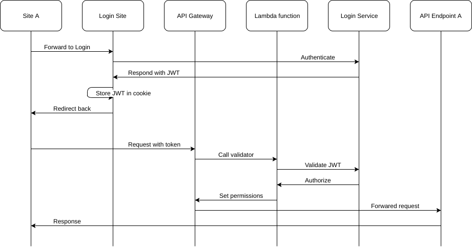
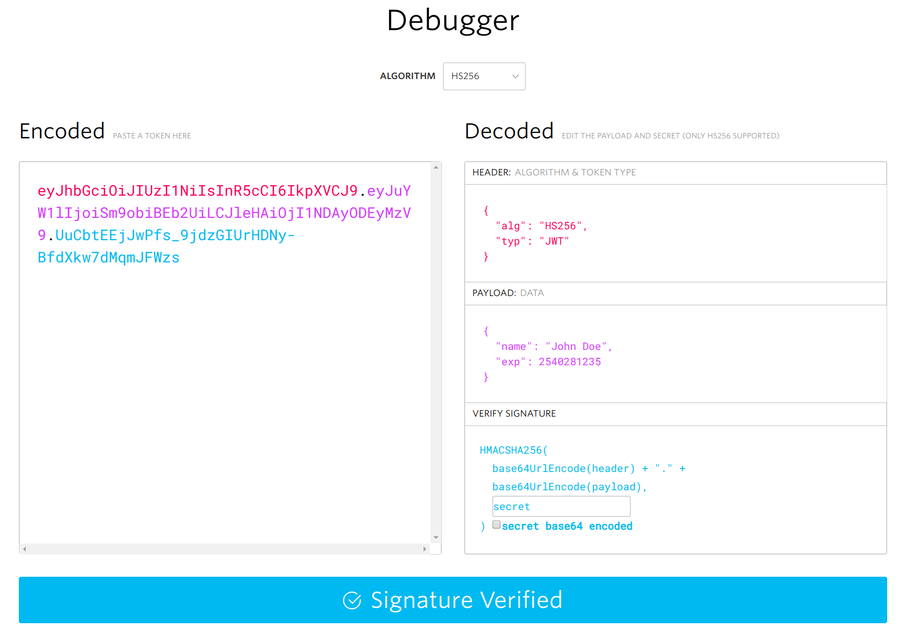
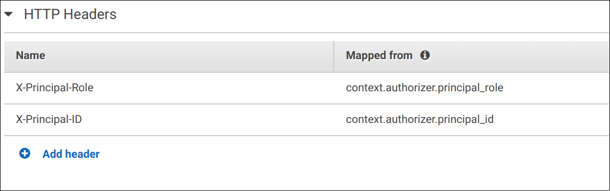

### Introduction to Lambda's

<!-- .slide: data-background="img/background-orange-orig.jpg" -->

---

### What is a Lambda function?

- Anonymous function
- In terms of AWS:
  - Event-driven
  - 'serverless'
  - Node.js, Python, Java and C#

---

### Usages

- Data processing
  - File processing, e.g. transformation of images
  - Stream processing, e.g. handling of Kinesis events
- Backends
  - IoT
  - Mobile or Web

---

### Within the AWS eco-system

AWS Lambda connects to various other services:
- Kinesis
- S3 buckets
- API Gateway
- DynamoDB
- Redshift
- etc

---

### Alternatives

- Google Cloud Functions (Beta)
- Azure Functions
- Apache OpenWhisk (Incubator)

---

### Lambda integration with API Gateway
#### Example use-case from Royal FloraHolland

<!-- .slide: data-background="img/background-green-orig.jpg" -->

---

### Use-Case

Protect endpoints from unauthorized usage

---

### Authentication Flow

<p></p>

---

### JWT - JSON Web Tokens

<p></p>

https://jwt.io

---

### JWT - Create Tokens

```Java
Algorithm algorithm = Algorithm.HMAC256(secret);
return JWT.create()
                .withIssuer(issuer)
                .withSubject(user.getUserId())
                .withClaim(CLAIM_PRINCIPAL_ROLE, user.getType().toString())
                .withAudience(audience)
                .withExpiresAt(new Date(System.currentTimeMillis() + expiryInMillies))
                .sign(algorithm);
```

---

### JWT - Validate Tokens

```Java
Algorithm algorithm = Algorithm.HMAC256(secret);
JWTVerifier verifier = JWT.require(algorithm)
                .withIssuer(issuer)
                .withAudience(audience)
                .acceptLeeway(0)
                .build();
final DecodedJWT decodedJWT = verifier.verify(token);
```

---

### Authorizer Lambda Function

```Python
# Example methodArn: arn:aws:execute-api:eu-west-1:471518:vyxba/staging/GET/some-service/resource
ARN_REGION_PART = 3
ARN_AWSACCOUNT_PART = 4
ARN_URI_PART = 5
ARN_URI_PART_APIID_PART = 0
ARN_URI_PART_STAGE_PART = 1
ARN_URI_PART_METHOD_PART = 2
ARN_URI_PART_SERVICE_PART = 3


def lambda_handler(event, context):
    print(context.aws_request_id + " - Client token: " + event['authorizationToken'])
    print(context.aws_request_id + " - Method ARN: " + event['methodArn'])

    # Get some basic values out of the Method ARN
    tmp_split_method_arn = event['methodArn'].split(':')
```

---

### Policy Result

```json
{
    "Version": "2012-10-17",
    "Statement": [
        {
            "Sid": "Stmt1467321237000",
            "Effect": "Deny",
            "Action": [
                "apigateway:POST",
                "apigateway:PUT",
                "apigateway:PATCH",
                "apigateway:DELETE"
            ],
            "Resource": [
                "arn:aws:apigateway:us-east-1::/*"
            ]
        },
        {
            "Sid": "Stmt1467321344000",
            "Effect": "Allow",
            "Action": [
                "apigateway:GET",
                "apigateway:HEAD",
                "apigateway:OPTIONS"
            ],
            "Resource": [
                "arn:aws:apigateway:us-east-1::/restapis/*"
            ]
        }
    ]
}
```

---

### API Gateway Header Mapping

<p></p>

---
