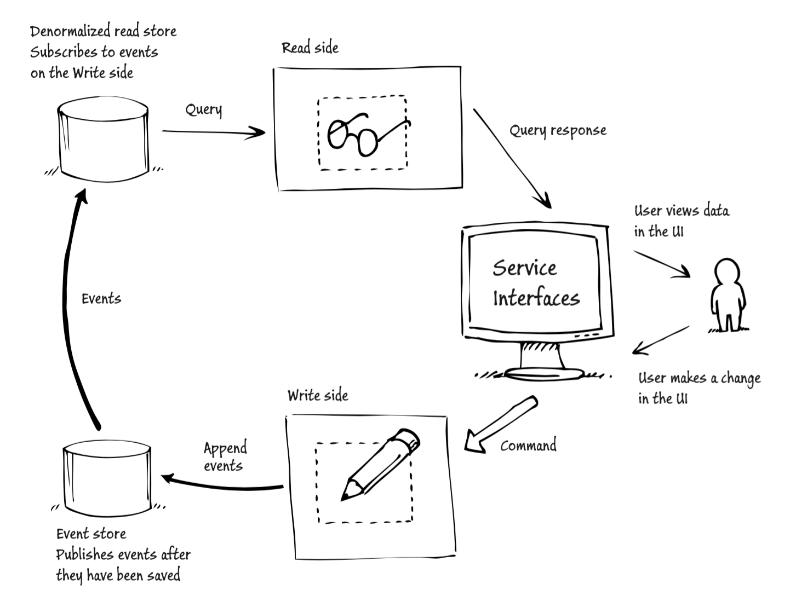
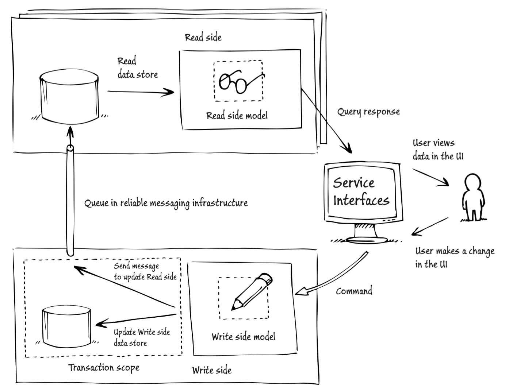

### Why??

<!-- .slide: data-background="img/background-orange-orig.jpg" -->

---

### What is CQRS

<!-- .slide: data-background="img/background-green-orig.jpg" -->

---

### What is CQRS

- Command Query Responsibility Segregation

---

### Traditional Architecture

<p></p>

&copy; Martin Fowler

---

### CQRS Architecture

<p></p>

&copy; Martin Fowler

---

### Storing data

- Simple approach
  - Single database
  - <span>Normalized</span> tables for write-side data <!-- .element: class="fragment highlight-blue"-->
  - Views for <span>denormalizing</span> data <!-- .element: class="fragment highlight-blue"-->
  - Keep queries simple

---

### CQRS related to DDD

- DDD - Domain Driven Design
- Bounded Context <!-- .element: class="fragment"-->
- Aggregate <!-- .element: class="fragment"-->
- Command <!-- .element: class="fragment"-->
- Event <!-- .element: class="fragment"-->

---

### What is ES

<!-- .slide: data-background="img/background-violet-orig.jpg" -->

---

### What is ES

- Event Sourcing
- Event describes the state change of _aggregate_
- Event is saved in event store
- Events can be replayed to re-create the current state.

---

### CQRS & ES Combined

<!-- .slide: data-background="img/background-orange-orig.jpg" -->

---

### Architecture with Transactions

<p></p>

&copy; Microsoft - CQRS Journey

---

### Architecture with Events

<p></p>

&copy; Microsoft - CQRS Journey

---

### Architecture with Messages

<p></p>

&copy; Microsoft - CQRS Journey

---

### The hard parts

<!-- .slide: data-background="img/background-green-orig.jpg" -->

---

### Consistency

- Key feature for the Event Store
- Without transactions, much work needed to make as reliable <!-- .element: class="fragment"-->
- Versioning / timestamps <!-- .element: class="fragment"-->
<li><span>Eventual</span> consistency<!-- .element: class="fragment highlight-red"--></li>  <!-- .element: class="fragment"-->

---

### Error Handling

- Distinguish between business faults and errors.
  - Errors can be re-tried.
  - Business faults should have pre-determined reaction.

---

### Other disadvantages

- Many moving parts, makes it hard to debug the system as a whole
- CQRS not for every bounded context

---

### Advantages

<!-- .slide: data-background="img/background-violet-orig.jpg" -->

---

### Advantages

- Task-based UI
- Read and write side can be optimized separately
- Debug in local environment
- Small components which are easy to update / fix

---

### Code

<!-- .slide: data-background="img/background-violet-orig.jpg" -->

---

### User Aggregate

Not Finished 😞
---

### User Repository

```
private var users = Set.empty[User]

override def receiveCommand: Receive = {
  case GetUsers =>
    sender() ! users
  case AddUser(name) if users.exists(_.name == name) =>
    sender() ! UserExists(name)
  case AddUser(user) =>
    persist(user) { persistedUser =>
      receiveRecover(persistedUser)
      sender() ! UserAdded(persistedUser)
    }
}

override def receiveRecover: Receive = {
  case user: User => users += user
}
```

---

### Event Sender

```
private var unconfirmed = immutable.SortedMap.empty[Long, ActorPath]

override def receive: Receive = {
  case Msg(deliveryId, user) =>
    unconfirmed = unconfirmed.updated(deliveryId, sender().path)
    val headersMap = Map(RabbitMQConstants.MESSAGE_ID -> deliveryId, RabbitMQConstants.CORRELATIONID -> deliveryId)
    camelSender ! CamelMessage(user.asJson.noSpaces, headersMap)

  case CamelMessage(_, headers) =>
    val deliveryId: Long = headers.getOrElse(RabbitMQConstants.MESSAGE_ID, -1L).asInstanceOf[Long]
    unconfirmed.get(deliveryId).foreach(
        senderActor => {
          unconfirmed -= deliveryId
          context.actorSelection(senderActor) ! Confirm(deliveryId)
        })

  case Status.Failure(ex) =>
    log.error("Event delivery failed. Reason: {}", ex.toString)
}
```

---

### Event Receiver

```
override def receive: Receive = {
  case msg: CamelMessage =>
    val body: Xor[Error, User] = decode[User](msg.bodyAs[String])
    body.fold({ error =>
      sender() ! Failure(error)
    }, { user =>
      sender() ! Ack
    })
  case _ => log.warning("Unexpected event received")
}
```

---

### Links

- [Martin Fowler - CQRS](http://martinfowler.com/bliki/CQRS.html)
- [Microsoft - CQRS Journey](https://msdn.microsoft.com/en-us/library/jj554200.aspx)
- [Akka](http://doc.akka.io/docs/akka/current/scala.html)
- [Heiko Seeberger - Reactive Flows Demo](https://github.com/hseeberger/reactive-flows)

