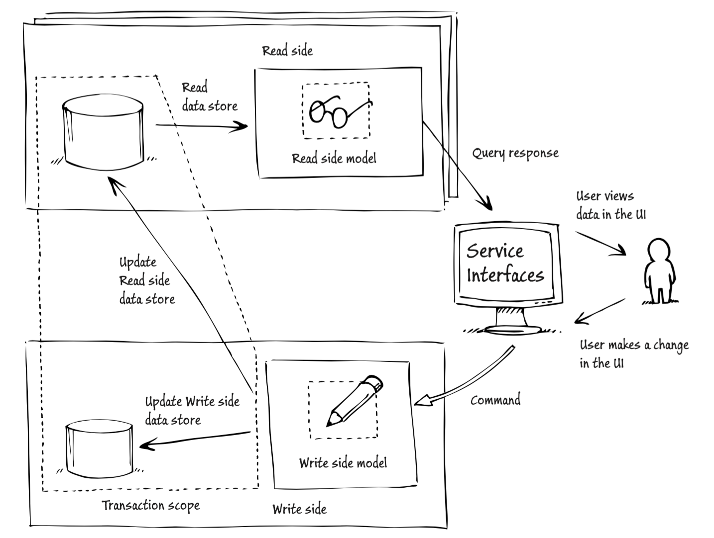
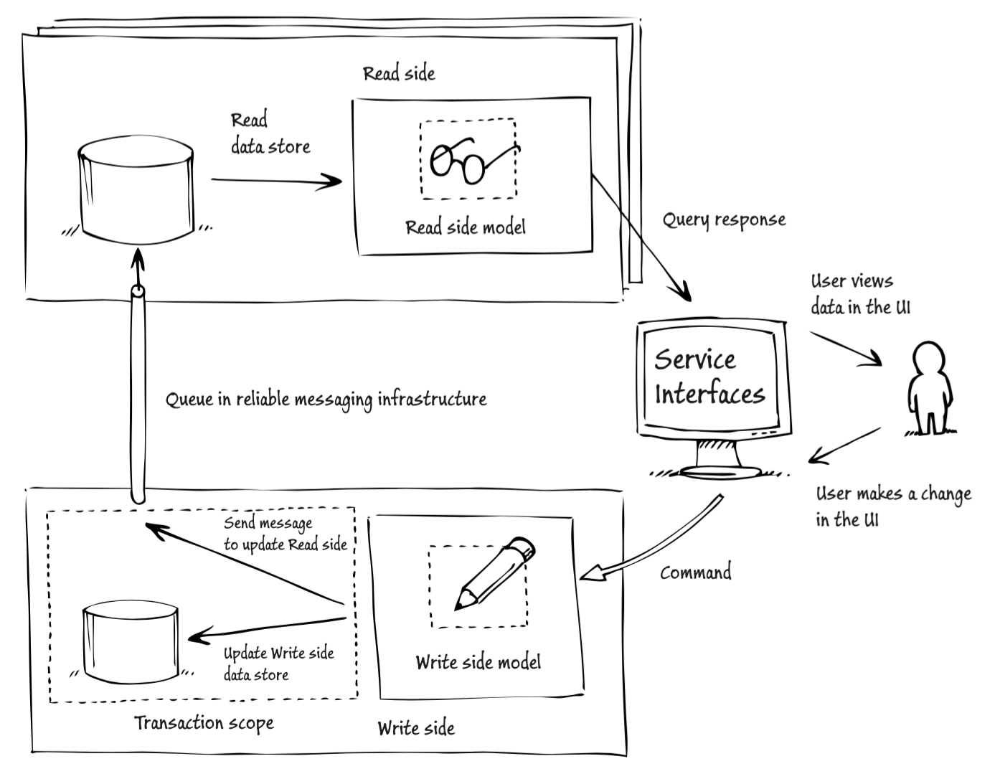

### What is ES

<!-- .slide: data-background="img/background-violet-orig.jpg" -->

---

### What is ES

- Event Sourcing
- Event describes the state change <!-- .element: class="fragment highlight-blue"-->of _aggregate_
- Event is saved in event store <!-- .element: class="fragment highlight-blue"-->
- Events can be replayed to re-create the current state.

---

### CQRS & ES Combined

<!-- .slide: data-background="img/background-orange-orig.jpg" -->

---

### Architecture with Transactions

&copy; Microsoft - CQRS Journey

---

### Architecture with Messages

&copy; Microsoft - CQRS Journey

---

### The hard parts

<!-- .slide: data-background="img/background-green-orig.jpg" -->

---

### Consistency

- Key feature for the Event Store
- Without transactions, much work needed to make as reliable <!-- .element: class="fragment"-->
- Versioning / timestamps <!-- .element: class="fragment"-->
<li>Eventual consistency<!-- .element: class="fragment highlight-red"--></li>  <!-- .element: class="fragment"-->

---

### Error Handling

- Distinguish between business faults and errors.
  - Errors can be re-tried.
  - Business faults should have pre-determined reaction.

---

### Other disadvantages

- Many moving parts, makes it hard to debug the system as a whole
- CQRS not for every bounded context

---

### Advantages

<!-- .slide: data-background="img/background-orange-orig.jpg" -->

---

### Advantages

- Auditing and historical tracing
- Read and write side can be optimized separately <!-- .element: class="fragment highlight-red"-->
- Debug in local environment
- Small components which are easy to update / fix
- No ORM impedance mismatch

Note:
Impedance mismatch = mismatch in mapping from objects (graphs) to tables (records)

