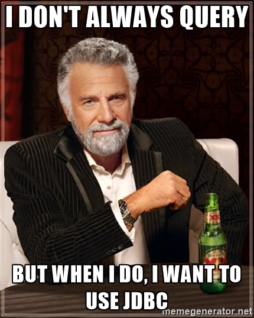

### Lagom microservice framework

<!-- .slide: data-background="img/background-violet-orig.jpg" -->

---

### Design philosophy

- Distributed<!-- .element: class="fragment"-->
- Asynchronous<!-- .element: class="fragment"-->
- Productivity<!-- .element: class="fragment"-->

---

### Concepts

- Microservices
- Polyglot
- Design Driven APIs
- Immutability
- Event Sourcing and CQRS

---

### Opiniated

```Scala
ServiceCall<Source<String, NotUsed>, Source<String, NotUsed>> stream();

@Override
default Descriptor descriptor() {
  return named("stream").withCalls(namedCall("stream", this::stream))
    .withAutoAcl(true);
}
```

---

### Core technologies

- Akka
  - Akka Streams
  - Akka Persistence
  - Akka Cluster
- Play
- ConductR

Note:
Play used as Web Framework
Kafka used for Reactive Streams middleware

---

### Lagom persistence

- Cassandra
- `PersistentEntity`
  - Requires `Command`, `Event` and `State`
- Single instance kept in memory

Note:
Instance is passivated when not in use

---

### Command - Event - State

<p></p>

---

<p></p>

---

### Query example

<p></p>
Get me all inspections with remarks for a given ship

---

### Lagom JDBC support

- Available in 1.2 release
- Slick
- Storing and reading entities

Note:
Slick for ORM and asynchronous execution of JDBC

