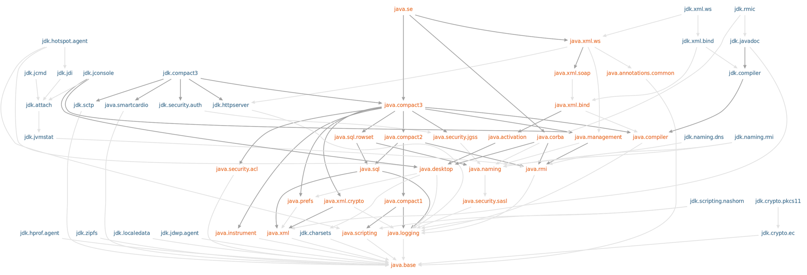

### Modularization

<!-- .slide: data-background="img/background-orange-orig.jpg" -->

---

### What is a module?

- Group of classes
- Described by `module-info.java`, contains:
  - Name of module
  - Exported <span>packages</span>  <!-- .element: class="fragment highlight-red"-->
  - Required <span>modules</span>  <!-- .element: class="fragment highlight-blue"-->

```
module nl.codecentric.socket {
        exports nl.codecentric.socket;
        exports nl.codecentric.socket.spi;
}

module nl.codecentric.test {
        requires nl.codecentric.socket;
}
```

---

### JDK modules

<p></p>

- `java.base` at the bottom of the graph
- Automatically included

---

### Compilation

```
javac -d mods -modulesourcepath src $(find src -name "*.java")
```

- `-d` specifies output directory
- `-modulesourcepath` specifies path to compile multiple modules
  - opposed to `-modulepath` for a single module path

---

### Running

```
java -modulepath mods -m nl.codecentric.test/nl.codecentric.test.Main
```
or
```
java -mp mlib -m nl.codecentric.test
```

- Again specify module-path with `-modulepath` or `-mp`
- Specify the module to run with `-m`

---

### Create JARs

```
jar --create --file=mlib/socket@1.0.jar --module-version=1.0 -C mods/nl.codecentric.socket .
```

- Versioning is not effectively used

---

### Automatic Modules

- JAR on the module-path
  - Name = name of the JAR-file
  - Exports all packages
  - Reads all other available modules

---

### Unnamed Module

- Files from the classpath
  - Name = 'unnamed'
  - Exports all packages (but other modules cannot 'read' them)
  - Reads all other available modules

---

### Automatic resolution

```
ServiceLoader<NetworkSocketProvider> sl = ServiceLoader.load(NetworkSocketProvider.class);
```

---

### List Modules

```
private static void printModules() {
    Layer layer = Layer.boot();
    // Show it in the ui
    layer.modules().stream().filter(m -> m.getName().startsWith("nl.codecentric")).forEach(m -> {
        String name = m.getName();
        Optional<ModuleDescriptor.Version> version = m.getDescriptor().version();
        // Show it in the ui
        System.out.println("Loaded module: " + name + " - version: " + version);
    });
}
```

---

### Other specifics

- Circular dependencies handled at compile-time

- No two versions of one module
  - Compile-time error if same name
  - Runtime error for other name but different packages

---

### Create minimal Java installation

```
jlink --modulepath $JAVA_HOME/jmods:mlib --addmods nl.codecentric.test,nl.codecentric.fastsocket --output target
```

- Caveat: Need to specify implementation because no direct reference exists

---
